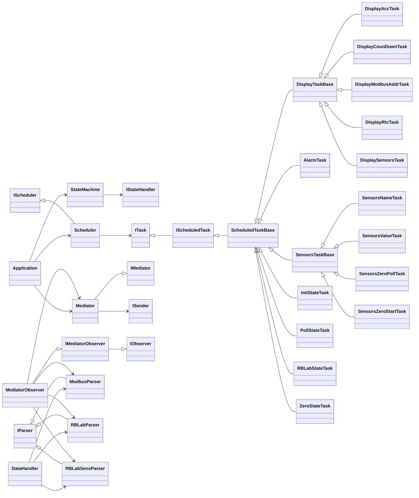
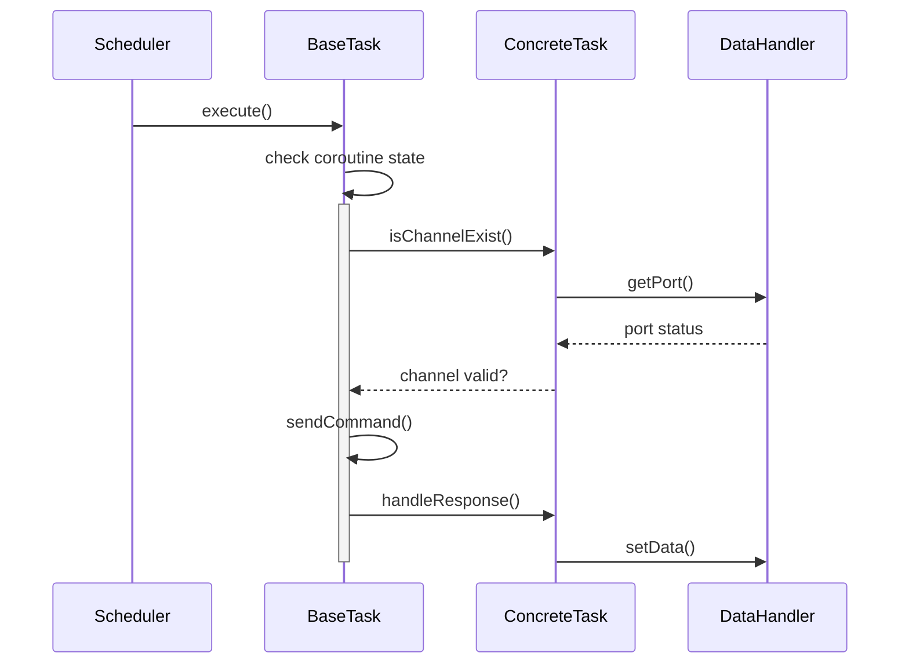

# Диаграмма классов

```mermaid
classDiagram
direction LR
    class Application
    class StateMachine
    class IStateHandler
    class Scheduler
    class IScheduler
    class ITask
    class IScheduledTask
    class ScheduledTaskBase
    class Mediator
    class IMediator
    class ISender
    class MediatorObserver
    class IMediatorObserver
    class IObserver
    class DataHandler
    class ModbusParser
    class RBLabParser
    class RBLabSensParser
    class DisplayTaskBase
    class DisplayAccTask
    class DisplayCounDownTask
    class DisplayModbusAddrTask
    class DisplayRtcTask
    class DisplaySensorsTask
    class AlarmTask
    class SensorsTaskBase
    class SensorsNameTask
    class SensorsValueTask
    class SensorsZeroPollTask
    class SensorsZeroStartTask
    class InitStateTask
    class PollStateTask
    class RBLabStateTask
    class ZeroStateTask
    class IParser

    Application --> StateMachine
    Application --> Scheduler
    Application --> Mediator
    StateMachine --> IStateHandler

    Scheduler --> ITask
    IScheduler <|-- Scheduler
    ITask <|-- IScheduledTask
    IScheduledTask <|-- ScheduledTaskBase
    ScheduledTaskBase <|-- AlarmTask
    ScheduledTaskBase <|-- DisplayTaskBase
    ScheduledTaskBase <|-- SensorsTaskBase
    DisplayTaskBase <|-- DisplayAccTask
    DisplayTaskBase <|-- DisplayCounDownTask
    DisplayTaskBase <|-- DisplayModbusAddrTask
    DisplayTaskBase <|-- DisplayRtcTask
    DisplayTaskBase <|-- DisplaySensorsTask
    SensorsTaskBase <|-- SensorsNameTask
    SensorsTaskBase <|-- SensorsValueTask
    SensorsTaskBase <|-- SensorsZeroPollTask
    SensorsTaskBase <|-- SensorsZeroStartTask
    ScheduledTaskBase <|-- InitStateTask
    ScheduledTaskBase <|-- PollStateTask
    ScheduledTaskBase <|-- RBLabStateTask
    ScheduledTaskBase <|-- ZeroStateTask
    Mediator --|> IMediator
    Mediator --> ISender
    MediatorObserver --|> IMediatorObserver
    IMediatorObserver --|> IObserver
    DataHandler --> ModbusParser
    DataHandler --> RBLabParser
    DataHandler --> RBLabSensParser
    IParser <|-- ModbusParser
    IParser <|-- RBLabParser
    IParser <|-- RBLabSensParser
    MediatorObserver --> ModbusParser
    MediatorObserver --> RBLabParser
    MediatorObserver --> RBLabSensParser
    MediatorObserver --> Mediator


```

# Диаграмма процессов coroutine классов Sensor_Task

```mermaid

sequenceDiagram
    participant Scheduler
    participant BaseTask
    participant ConcreteTask
    participant DataHandler
    
    Scheduler->>BaseTask: execute()
    BaseTask->>BaseTask: check coroutine state
    activate BaseTask
    BaseTask->>ConcreteTask: isChannelExist()
    ConcreteTask->>DataHandler: getPort()
    DataHandler-->>ConcreteTask: port status
    ConcreteTask-->>BaseTask: channel valid?
    BaseTask->>BaseTask: sendCommand()
    BaseTask->>ConcreteTask: handleResponse()
    ConcreteTask->>DataHandler: setData()
    deactivate BaseTask

```
***

